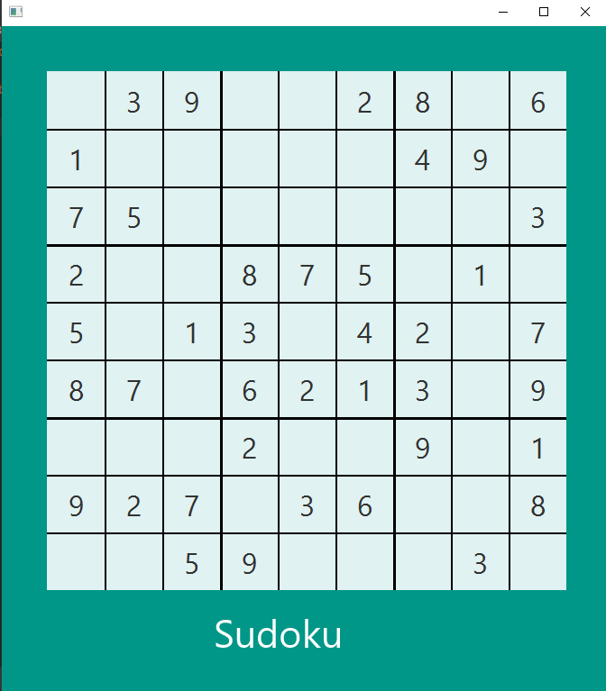

### Sudoku game in Java

A desktop app where you can play sudoku. Done with JavaFX, this was the most advanced and difficult project I've done so far for my Java level. I followed a guide to complete it and I used a lot of code I had not learned yet, including writing algorithms and UI.

